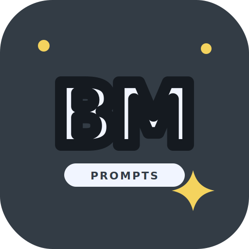

<div align="center">


# brand-maker

**Fun, configurable prompts for logo ideas that feel handmade — optimized for ChatGPT image generation.**

<p>
<a href="LICENSE"></a>
<a href="https://github.com/mocasus/brand-maker/actions"></a>
<a href="https://github.com/mocasus/brand-maker/stargazers"></a>
<a href="https://github.com/mocasus/brand-maker/commits/main"></a>
</p>

<p>


</p>

<p>
<a href="#-quick-start"><b>Quick Start</b></a> ·
<a href="#-prompt-library"><b>Prompt Library</b></a> ·
<a href="#-logo-system"><b>Logo System</b></a> ·
<a href="#-configuration"><b>Configuration</b></a> ·
<a href="CONTRIBUTING.md"><b>Contribute</b></a>
</p>

</div>

---

## ✨ Why This Exists

Most AI logo prompts produce the same problems: random gradients, stiff icons, weird text, fake shadows, and designs that look obviously generated. **brand-maker** collects prompt templates that are easier to customize and easier to iterate in ChatGPT.

- **ChatGPT-first**: prompts are written for GPT Image / DALL-E style generation.
- **Configurable**: swap `[BRAND_NAME]`, `[SUBJECT]`, `[MAIN_COLOR]`, `[BACKGROUND_COLOR]`, and `[VIBE]`.
- **Style-specific**: includes Claude-like warmth, ChatGPT-style geometry, Gemini sparkles, kawaii icons, and fun typography.
- **Iteration-ready**: every prompt includes follow-up commands for fixing common output issues.
- **Repo-friendly**: includes validation workflow and a CLI helper for filling prompt variables.

---

## 🚀 Quick Start

```bash
git clone https://github.com/mocasus/brand-maker.git
cd brand-maker

./scripts/fill-prompt.sh prompts/typography/fun-wordmark.md \
  --subject "logo prompt library" \
  --icon "#FF6B6B" \
  --bg "#FFF7ED"
```

Then paste the output into ChatGPT image generation and iterate with commands like:

- `make the typography more bubbly and hand-lettered`
- `make the wordmark cleaner and easier to read at small sizes`
- `keep the same colors but reduce decorations by 40%`
- `make it feel like a playful startup logo, not a children’s toy brand`

---

## 🎨 Prompt Library

### Fun Typography

- **[Fun Wordmark](prompts/typography/fun-wordmark.md)** — colorful rounded typography inspired by handmade sticker logos.
- **[Badge Wordmark](prompts/typography/badge-wordmark.md)** — compact badge/label version for avatars, socials, and GitHub headers.

### AI Brand Style Clones

- **[Claude Style](prompts/ai-brand-clones/claude-style.md)** — warm terracotta, soft organic forms, calm human-centered feel.
- **[ChatGPT Style](prompts/ai-brand-clones/chatgpt-style.md)** — geometric knot/flower symmetry.
- **[Gemini Style](prompts/ai-brand-clones/gemini-style.md)** — sparkle, magic, blue-purple gradient energy.
- **[Perplexity Style](prompts/ai-brand-clones/perplexity-style.md)** — teal pinwheel and information-flow geometry.
- **[Grok Style](prompts/ai-brand-clones/grok-style.md)** — bold angular X, monochrome edge.
- **[Copilot Style](prompts/ai-brand-clones/copilot-style.md)** — fluid ribbon and collaboration wave.
- **[Mistral Style](prompts/ai-brand-clones/mistral-style.md)** — warm pixel grid, technical retro energy.

### Kawaii Flat Icons

- **[Blob](prompts/kawaii-icons/blob.md)** — universal squishy app icon template.
- **[Robot](prompts/kawaii-icons/robot.md)** — rounded AI robot head.
- **[Ghost](prompts/kawaii-icons/ghost.md)** — playful wavy-bottom ghost icon.

---

## 🧩 Logo System

<div align="center">
<table>
<tr>
<td align="center" width="50%">
<br>
<b>Primary wordmark</b><br>
<sub>Use in README headers, social banners, landing pages.</sub>
</td>
<td align="center" width="50%">
<br>
<b>Compact mark</b><br>
<sub>Use as avatar, favicon concept, or square preview.</sub>
</td>
</tr>
</table>
</div>

Design direction:

- Rounded bubble lettering with strong black stroke and white inner outline.
- Candy gradient fill, but still readable and high-contrast.
- Sticker-like energy: playful sparkles, dots, and soft warm background.
- Fun typography first — not another generic abstract AI icon.

---

## 🎛️ Configuration

Use these variables across prompt files:

| Placeholder | Meaning | Example |
|---|---|---|
| `[BRAND_NAME]` | Name to render | `brand-maker`, `Moyzell`, `OpenFile` |
| `[SUBJECT]` | Concept or mascot | `logo prompt library`, `friendly robot`, `sparkle palette` |
| `[MAIN_COLOR]` / `[ICON_COLOR]` | Main foreground | `#FF6B6B`, `#FFFFFF` |
| `[BACKGROUND_COLOR]` | Canvas/background | `#FFF7ED`, `#C15F3C` |
| `[ACCENT_COLOR]` | Decoration/accent | `#38BDF8`, `#FACC15` |
| `[VIBE]` | Visual tone | `fun typography`, `Claude-like warm`, `premium playful` |

---

## 🖼️ Generator Notes

| Generator | Best Use | Notes |
|---|---|---|
| **ChatGPT / GPT Image** | Primary workflow | Best for following long structured prompts and edits. |
| **DALL·E 3** | Clean icon concepts | Great first drafts; may need typography cleanup. |
| **Midjourney** | Visual exploration | Add `--style raw --ar 1:1` for controlled outputs. |
| **Ideogram** | Text-heavy logos | Best choice when the exact wordmark text matters. |
| **Recraft** | Vector/logo polish | Strong for flat logo refinement. |

---

## 📁 Structure

```text
brand-maker/
├── assets/                     # Logo system + references
├── examples/                   # Generation logs and gallery
├── prompts/
│   ├── typography/             # Fun wordmark prompts
│   ├── ai-brand-clones/        # Claude, ChatGPT, Gemini, etc.
│   └── kawaii-icons/           # Blob/robot/ghost templates
├── scripts/fill-prompt.sh      # Variable substitution helper
└── .github/workflows/          # Prompt validation + stats update
```

---

## ⚖️ Disclaimer

This repo is not affiliated with Anthropic, OpenAI, Google, xAI, Microsoft, Perplexity, Midjourney, or Mistral. Prompts are for creating original logos inspired by public visual styles — do not impersonate existing brands.

---

<div align="center">

Built by [@mocasus](https://github.com/mocasus) · Contact: [Telegram @rubuskap](https://t.me/rubuskap)

<sub>v1.1.0 · 2026 · MIT</sub>

</div>
