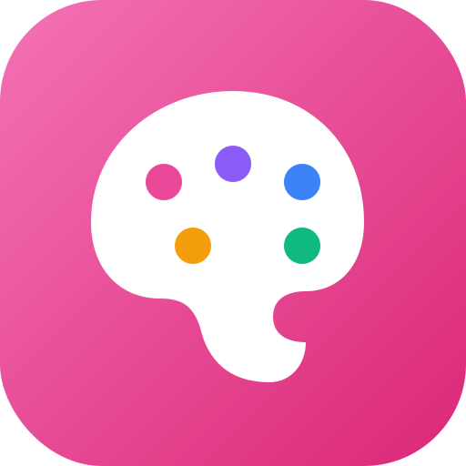

<div align="center">


# brand-maker

**🎨 Curated AI prompts to generate logos that don't look AI-generated**

Kawaii app icons · AI brand style clones · Battle-tested prompts for the top image generators

<br>

<p>
<a href="LICENSE"></a>
<a href="https://github.com/mocasus/brand-maker/stargazers"></a>
<a href="https://github.com/mocasus/brand-maker/commits/main"></a>
<a href="https://github.com/mocasus/brand-maker/actions"></a>
</p>

<b>Tested on real generators:</b>

<p>


</p>

<p>
<a href="#-quick-start"><b>Quick Start</b></a> ·
<a href="#-prompt-library"><b>Prompts</b></a> ·
<a href="#%EF%B8%8F-gallery"><b>Gallery</b></a> ·
<a href="#%EF%B8%8F-configuration"><b>Config</b></a> ·
<a href="CONTRIBUTING.md"><b>Contribute</b></a>
</p>

</div>

---

<details open>
<summary><b>🇬🇧 English</b></summary>

<br>

Get logos that look **designed, not generated**. This repo is a curated collection of prompts specifically engineered to produce clean, professional, brand-worthy logos from AI image generators — the kind you'd actually use, not the "AI slop" you'd throw away.

**What makes these prompts different:**

- 🎯 **Battle-tested** — every prompt refined through 20+ generations
- 🎨 **Style-locked** — no random gradients, weird faces, or 3D artifacts
- 🎛️ **Configurable** — swap `[SUBJECT]` + `[ICON_COLOR]` + `[BACKGROUND_COLOR]` and go
- 🎭 **Brand-aware** — nail Claude's warmth, ChatGPT's geometry, Gemini's magic
- 🔧 **CLI-ready** — `./scripts/fill-prompt.sh` handles substitution
- 📸 **Documented results** — every prompt ships with generated examples

**Best for:** indie brands, startup MVPs, personal projects, learning prompt engineering.

</details>

<details>
<summary><b>🇮🇩 Bahasa Indonesia</b></summary>

<br>

Dapatkan logo yang **kelihatan didesain, bukan digenerate**. Repo ini kumpulan prompt yang di-tune khusus buat menghasilkan logo bersih, profesional, dan siap dipake dari AI image generator — bukan hasil "AI slop" yang biasanya harus dibuang.

**Kenapa prompt di sini beda:**

- 🎯 **Battle-tested** — tiap prompt di-refine lewat 20+ generation
- 🎨 **Style-locked** — no gradient random, muka aneh, atau artifact 3D
- 🎛️ **Configurable** — ganti `[SUBJECT]` + `[ICON_COLOR]` + `[BACKGROUND_COLOR]` selesai
- 🎭 **Brand-aware** — dapetin warmth-nya Claude, geometry-nya ChatGPT, magic-nya Gemini
- 🔧 **CLI-ready** — `./scripts/fill-prompt.sh` handle substitution otomatis
- 📸 **Terdokumentasi** — tiap prompt punya contoh hasil generation

**Cocok untuk:** brand indie, MVP startup, proyek personal, belajar prompt engineering.

</details>

---

## 🖼️ Gallery

<table align="center">
<tr>
<td align="center" width="33%">
<br>
<b>Sparkle Premium</b> ⭐<br>
<code>ai-brand-clones/gemini-style.md</code><br>
<sub>The logo of this repo</sub>
</td>
<td align="center" width="33%">
<br>
<b>Kawaii Palette</b><br>
<code>kawaii-icons/blob.md</code><br>
<sub>Pink gradient · Paint dots</sub>
</td>
<td align="center" width="33%">
<br>
<b>Your generation</b><br>
<a href="CONTRIBUTING.md">Submit via PR</a><br>
<sub>Get featured in gallery</sub>
</td>
</tr>
</table>

<div align="center"><i>See <a href="examples/gallery.md">full gallery</a> for all variants and user contributions.</i></div>

---

## 🎨 Prompt Library

### 🎭 AI Brand Style Clones

<table>
<tr>
<td>

**[Claude](prompts/ai-brand-clones/claude-style.md)** ⭐<br>
<sub>Terracotta warmth · Organic blob<br>`#C15F3C` · `#FFFFFF`</sub>

</td>
<td>

**[ChatGPT](prompts/ai-brand-clones/chatgpt-style.md)**<br>
<sub>Green knot · 6-fold symmetry<br>`#10A37F` · `#FFFFFF`</sub>

</td>
<td>

**[Gemini](prompts/ai-brand-clones/gemini-style.md)**<br>
<sub>4-point sparkle · Gradient<br>`#4285F4` → `#9333EA`</sub>

</td>
</tr>
<tr>
<td>

**[Perplexity](prompts/ai-brand-clones/perplexity-style.md)**<br>
<sub>Pinwheel · Rotating diamond<br>`#20B8CD` · `#FFFFFF`</sub>

</td>
<td>

**[Grok](prompts/ai-brand-clones/grok-style.md)**<br>
<sub>Angular X · Monochrome<br>`#000000` · `#FFFFFF`</sub>

</td>
<td>

**[Copilot](prompts/ai-brand-clones/copilot-style.md)**<br>
<sub>Ribbon · Fluid gradient<br>`#00A2FF` → `#0078D4`</sub>

</td>
</tr>
<tr>
<td>

**[Mistral](prompts/ai-brand-clones/mistral-style.md)**<br>
<sub>Pixel grid · Warm palette<br>Yellow → Orange → Red</sub>

</td>
<td colspan="2">

<i>More AI brand styles coming soon. <a href="CONTRIBUTING.md">Contribute yours!</a></i>

</td>
</tr>
</table>

### 🌸 Kawaii Flat Icons

- **[Blob](prompts/kawaii-icons/blob.md)** — Universal squishy shape · Works for any brand
- **[Robot](prompts/kawaii-icons/robot.md)** — Rounded rectangle robot head · Tech/AI focus
- **[Ghost](prompts/kawaii-icons/ghost.md)** — Wavy-bottom silhouette · Playful apps

---

## 🚀 Quick Start

### 30-second workflow

```bash
# 1. Clone
git clone https://github.com/mocasus/brand-maker.git && cd brand-maker

# 2. Fill in your brand
./scripts/fill-prompt.sh prompts/ai-brand-clones/claude-style.md \
  --subject "friendly robot" \
  --icon "#FFFFFF" \
  --bg "#C15F3C"

# 3. Copy output → paste to ChatGPT → generate → iterate
```

**Or skip the CLI:** Open any `.md` file in `prompts/`, copy the code block, replace `[VARIABLES]` manually, paste to your generator.

### Iteration commands (works with ChatGPT/DALL-E)

After first generation, refine with:
- `"make the eyes 40% larger"`
- `"less asymmetric, more geometric"`
- `"remove gradients, strictly flat"`
- `"try warmer background color"`
- `"add subtle blush on cheeks"`

---

## 🎛️ Configuration

Every prompt uses these standardized placeholders:

| Placeholder | Purpose | Example |
|-------------|---------|---------|
| `[SUBJECT]` | Character/shape | `friendly robot`, `cat head`, `abstract blob` |
| `[ICON_COLOR]` | Foreground hex | `#FFFFFF`, `#F5D0A9` |
| `[BACKGROUND_COLOR]` | Squircle background hex | `#C15F3C`, `#0F172A` |
| `[ACCENT_COLOR]` | Optional 3rd color | `#F59E0B` |

### Style Modifiers

Append to any prompt for variations:

| Modifier | Effect |
|----------|--------|
| `--extra-kawaii` | Bigger eyes (35-40% face height) |
| `--sleepy` | Half-closed horizontal eyes |
| `--blush` | Cheek blush marks |
| `--techy` | Add antenna, subtle circuit hints |
| `--wordmark` | Include brand name text below |
| `--minimal` | Strip all extras, pure shape only |
| `--dark-mode` | Auto-swap to dark background variant |

---

## 🖼️ Generator Compatibility

| Generator | Rating | Best Setting |
|-----------|--------|--------------|
| **ChatGPT (GPT Image / DALL-E 3)** | ⭐⭐⭐⭐⭐ | Default — all prompts tuned for this |
| **Midjourney v7+** | ⭐⭐⭐⭐⭐ | Append `--style raw --v 7 --ar 1:1 --stylize 100` |
| **DALL-E 3 (direct API)** | ⭐⭐⭐⭐ | Use "vivid" style, 1024x1024 |
| **Ideogram v2** | ⭐⭐⭐⭐⭐ | Set style to "Vector Illustration" |
| **Recraft v3** | ⭐⭐⭐⭐⭐ | Preset: "Flat Icon" — near-perfect first try |
| **Flux (Pro/Dev)** | ⭐⭐⭐⭐ | Prepend `flat vector icon, ((minimalist)), ((geometric)),` |
| **Stable Diffusion 3** | ⭐⭐⭐ | Use LoRA: `flat-icon-style-v2` for best results |
| **Google Gemini (Imagen 3)** | ⭐⭐⭐⭐ | Add "vector graphic" prefix |
| **DALL-E 2** | ⭐⭐ | Simplify prompts, expect more iteration |

Per-generator quirks documented in each prompt file.

---

## 📖 How It Works

Traditional AI image prompts fail at logos because they:
- Add random gradients and shadows
- Generate multiple subjects or backgrounds
- Break symmetry
- Include text/watermarks
- Look "AI-generated"

**brand-maker prompts solve this with:**

1. **Explicit negative prompts** — every prompt has 20+ negative constraints
2. **Percentage-based specs** — "eyes 30% of face height" beats "big eyes"
3. **Named color values** — `#C15F3C` beats "terracotta" for reproducibility
4. **Symmetry lock-in** — "perfectly symmetric along vertical axis" prevents drift
5. **Style anchoring** — reference specific design language (iOS 2024, Japanese kawaii, Dieter Rams)
6. **Composition guardrails** — padding %, aspect ratio, corner radius all specified

Result: logos that look like a designer made them, on the first or second generation.

---

## 📸 Examples

- 🖼️ **[Gallery](examples/gallery.md)** — brand-maker's own logos + user submissions
- 🤖 **[Moyzell Robot](examples/moyzell-robot.md)** — full generation log with 3 variants

Have you generated something? [Open a PR](CONTRIBUTING.md) to add your result!

---

## 🤝 Contributing

Prompts, examples, improvements — all welcome. See [CONTRIBUTING.md](CONTRIBUTING.md).

**Fastest way to contribute:**

1. Generate a logo using any prompt
2. Save your input config + resulting image
3. Open a PR adding to `examples/gallery.md`

---

## 📄 License

[MIT](LICENSE) © 2026 mocasus

**Note on generated outputs:** Logos you generate using these prompts are yours to use freely. Prompts are inspired by public brand aesthetics — don't use them to impersonate.

---

<div align="center">

**Built with ⚡ by [@mocasus](https://github.com/mocasus)**

Contact: [Telegram @rubuskap](https://t.me/rubuskap)

<sub>Not affiliated with Anthropic, OpenAI, Google, xAI, Microsoft, Perplexity, or Mistral.</sub>

</div>
