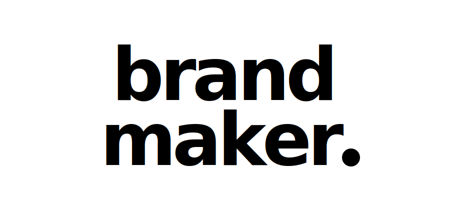

<div align="center">



# brand-maker

**Curated prompts for generating kawaii-style flat app icons via AI image generators**

<p>
<a href="LICENSE"></a>


</p>

[**Prompts**](#-prompt-library) · [**Config**](#-configuration) · [**Examples**](#-examples) · [**Contributing**](CONTRIBUTING.md)

</div>

---

<details open>
<summary><b>🇬🇧 English</b></summary>

<br>

A collection of production-tested prompts for generating **kawaii-style flat app icons** — squishy blob shapes with pill eyes, two-tone palettes, iOS-app-icon aesthetic. Configurable subject, colors, and style variations.

All prompts follow the same input contract: `[SUBJECT]` + `[ICON_COLOR]` + `[BACKGROUND_COLOR]` + optional style modifiers.

### ✨ Features

- 🎨 **10+ ready-to-use prompts** — copy, paste, generate
- 🎛️ **Configurable variables** — swap subject/colors in seconds
- 🖼️ **Multi-generator support** — ChatGPT, Midjourney, DALL-E, Flux, Ideogram
- 📐 **Style variations** — kawaii, geometric, mascot, minimalist
- 📸 **Reference examples** — see what each prompt produces
- 🔧 **CLI helper** — auto-fill variables from command line

</details>

<details>
<summary><b>🇮🇩 Bahasa Indonesia</b></summary>

<br>

Kumpulan prompt production-tested buat generate **kawaii-style flat app icon** — bentuk blob squishy dengan mata pill, dua warna, aesthetic iOS app icon. Bisa custom subject, warna, dan variasi style.

Semua prompt ikutin kontrak input yang sama: `[SUBJECT]` + `[ICON_COLOR]` + `[BACKGROUND_COLOR]` + modifier style opsional.

### ✨ Fitur

- 🎨 **10+ prompt siap pakai** — copy, paste, generate
- 🎛️ **Variabel configurable** — ganti subject/warna dalam detik
- 🖼️ **Multi-generator** — ChatGPT, Midjourney, DALL-E, Flux, Ideogram
- 📐 **Variasi style** — kawaii, geometric, mascot, minimalist
- 📸 **Contoh referensi** — lihat hasil tiap prompt
- 🔧 **CLI helper** — auto-fill variabel dari command line

</details>

---

## 🎨 Prompt Library

| Prompt | Style | Best For | File |
|--------|-------|----------|------|
| **Kawaii Blob** | Squishy blob + pill eyes | App icons, mascots | [`prompts/kawaii-icons/blob.md`](prompts/kawaii-icons/blob.md) |
| **Kawaii Robot** | Rounded rectangle robot | Tech/AI branding | [`prompts/kawaii-icons/robot.md`](prompts/kawaii-icons/robot.md) |
| **Kawaii Ghost** | Wavy-bottom ghost | Playful apps | [`prompts/kawaii-icons/ghost.md`](prompts/kawaii-icons/ghost.md) |
| **Kawaii Animal** | Cat/bear/fox head | Retail, community | [`prompts/kawaii-icons/animal.md`](prompts/kawaii-icons/animal.md) |
| **Geometric Cube** | Isometric cube wireframe | SaaS, dev tools | [`prompts/geometric/cube.md`](prompts/geometric/cube.md) |
| **Geometric Hexagon** | Layered hexagons | Infrastructure | [`prompts/geometric/hexagon.md`](prompts/geometric/hexagon.md) |
| **Mascot Character** | Full character w/ personality | Games, kids apps | [`prompts/mascot/character.md`](prompts/mascot/character.md) |

---

## 🎛️ Configuration

All prompts accept these variables:

```
[SUBJECT]           = What to draw (robot, cat, ghost, monster, etc.)
[ICON_COLOR]        = Foreground/character color (hex, e.g. #FFFFFF)
[BACKGROUND_COLOR]  = Squircle background color (hex, e.g. #C15F3C)
[ACCENT_COLOR]      = Optional third color for details (hex, optional)
```

**Style modifiers** (optional, append to any prompt):

- `--extra-kawaii` → bigger eyes (35-40% face height), extra squishy
- `--techy` → adds antenna, circuit hints
- `--sleepy` → half-closed horizontal eyes
- `--blush` → adds cheek blush marks
- `--wordmark` → adds brand name below icon

---

## 📸 Examples

### Kawaii Robot (Moyzell-style)

**Config:**
```
[SUBJECT]           = friendly robot
[ICON_COLOR]        = #FFFFFF
[BACKGROUND_COLOR]  = #C15F3C
```

**Result:** See [`examples/moyzell-robot.md`](examples/moyzell-robot.md) for full generation log.

### Kawaii Cat

**Config:**
```
[SUBJECT]           = round cat
[ICON_COLOR]        = #FFB4A2
[BACKGROUND_COLOR]  = #FDF6E3
```

Same prompt, different output — see [`examples/`](examples/) folder.

---

## 🚀 Quick Start

1. **Pick a prompt** from the library above
2. **Fill in the variables** (SUBJECT, colors)
3. **Paste to your AI image generator** (ChatGPT, Midjourney, etc.)
4. **Iterate** with style modifiers

Or use the CLI helper:

```bash
./scripts/fill-prompt.sh kawaii-icons/robot \
  --subject "robot" \
  --icon "#FFFFFF" \
  --bg "#C15F3C"
# Outputs filled prompt to stdout — pipe to clipboard
```

---

## 🖼️ Generator-Specific Tips

| Generator | Tip |
|-----------|-----|
| **ChatGPT (DALL-E 3)** | Use simpler language, remove "kawaii" if getting weird results |
| **Midjourney** | Add `--style raw --v 7 --ar 1:1 --stylize 100` |
| **Flux/SD** | Prepend `flat vector icon, app icon design,` |
| **Ideogram** | Set style to "Vector Illustration" |
| **Recraft** | Perfect for these — set to "Flat Icon" preset |

---

## 🤝 Contributing

Got a great prompt? PR welcome! See [CONTRIBUTING.md](CONTRIBUTING.md).

## 📄 License

[MIT](LICENSE) © 2026 mocasus

---

<div align="center">

**Built with ⚡ by [@mocasus](https://github.com/mocasus)** · Contact: [Telegram @rubuskap](https://t.me/rubuskap)

</div>
