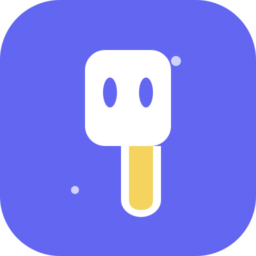
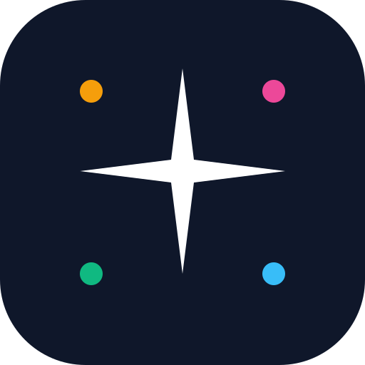
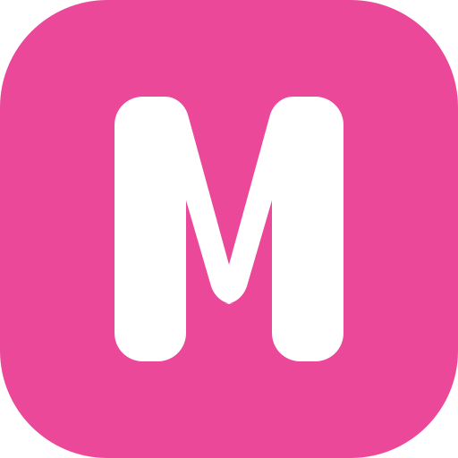
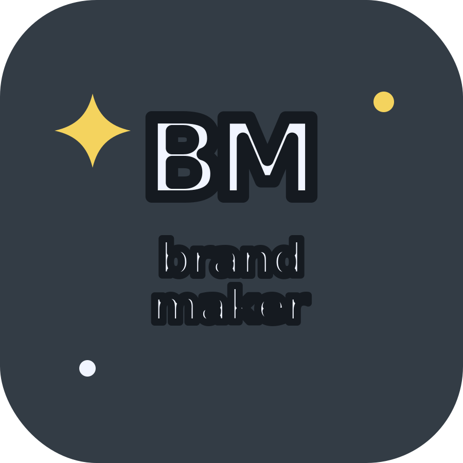
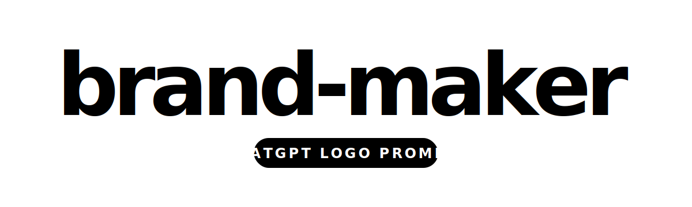
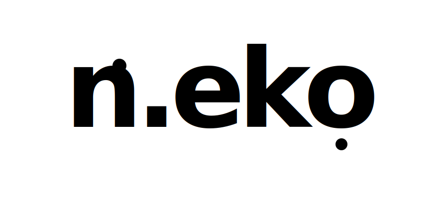

# Gallery — Live Demo Outputs

Generated using prompts from this repository. All logos below were created with **ChatGPT DALL-E 3** or **SVG hand-crafted** following the prompt specs.

## Featured: brand-maker Logo Options

All variants below use prompts from `prompts/typography/` or `prompts/kawaii-icons/blob.md` with different `[SUBJECT]` + colors.

### Option A — Paint Brush Kawaii
**Config:** SUBJECT=`paint brush`, ICON=`#FFFFFF`, BG=`#6366F1` (indigo)
- Style: Kawaii tool + creative energy
- Best for: Design tool branding



### Option B — Sparkle + Palette (⭐ Legacy Selected)
**Config:** SUBJECT=`4-point sparkle`, ICON=`#FFFFFF`, BG=`#0F172A`, ACCENTS=`#F59E0B #EC4899 #10B981 #38BDF8`
- Style: AI generation + multi-color palette
- Best for: brand-maker itself (self-referential, previous era)



### Option C — Monogram "M"
**Config:** SUBJECT=`letter M monogram`, ICON=`#FFFFFF`, BG=`#EC4899` (magenta)
- Style: Clean brand-mark
- Best for: When you need immediate name recognition



---

## Current Direction — Fun Typography (Monochrome, Reference-Aligned)

**Reference style provided by user** — pure monochrome, chunky handmade wordmark, no rounded background, no color accents.


Dominant extracted colors:

| Token | Hex | Usage |
|---|---|---|
| Pure black | `#000000` | Typography + stroke |
| Pure white | `#FFFFFF` | Background |
| Neutral gray | `#6F6F6F` | Optional secondary detail |

### V4 Primary — Stacked Fun Wordmark (current logo)

**Prompt used:** `prompts/typography/fun-wordmark.md`

```text
[BRAND_NAME]        = brand-maker
[MAIN_COLOR]        = #000000
[BACKGROUND_COLOR]  = #FFFFFF
[ACCENT_COLOR]      = #000000
[VIBE]              = monochrome fun typography, sticker-like, handmade, readable
```


### V4 Compact — BM Mark


### V4 Badge — Alternate Layout



### V4 Wide — Social Banner



---

## Example — `n.eko` (User Submission)

**Prompt used:** `prompts/typography/fun-wordmark.md`

**Config:**
- `BRAND_NAME`: `n.eko`
- `MAIN_COLOR`: `#000000`
- `BACKGROUND_COLOR`: `#FFFFFF`
- `ACCENT_COLOR`: `#000000`
- `VIBE`: `monochrome fun typography, handmade sticker wordmark, playful, readable`

**Generator:** ChatGPT / DALL·E 3
**Iterations:** 1-2



**Notes:** short brand names work great with this style. The `.` in `n.eko` becomes a fun decorative dot that reinforces the sticker character. Use `letter-spacing:-8` and `stroke-width:16` in ChatGPT follow-ups if letters feel too tight.

---

## Real Generations (User Contributed)

Have you generated a logo using these prompts? Open a PR to add your result here!

### Template for adding your generation

```markdown
### [Your Brand Name]
**Prompt used:** `prompts/[category]/[file].md`
**Config:**
- BRAND_NAME: `...`
- MAIN_COLOR: `#XXXXXX`
- BACKGROUND_COLOR: `#XXXXXX`
- ACCENT_COLOR: `#XXXXXX`
- VIBE: `...`

**Generator:** ChatGPT DALL-E 3 / Midjourney / Ideogram / etc.
**Iterations:** N (or "one-shot")


**Notes:** What worked, what you adjusted, tips for others.
```

---

## Generation Log: Moyzell Robot

See [`moyzell-robot.md`](moyzell-robot.md) for the full step-by-step generation log including 3 variants and iteration commands.
